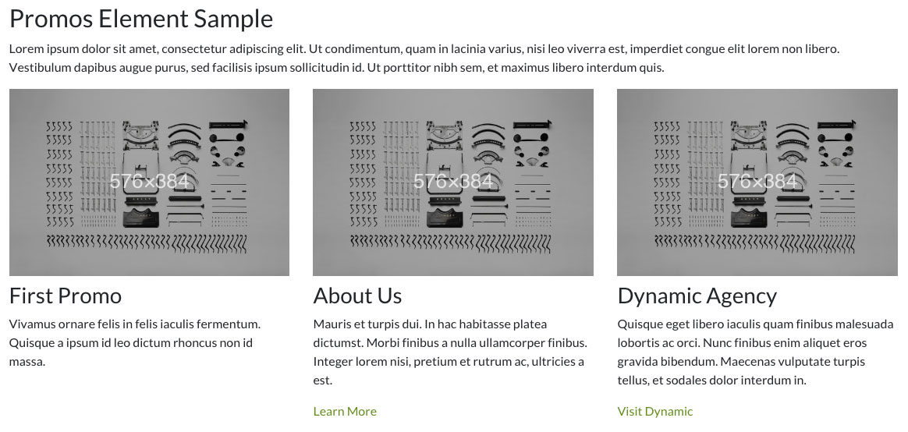
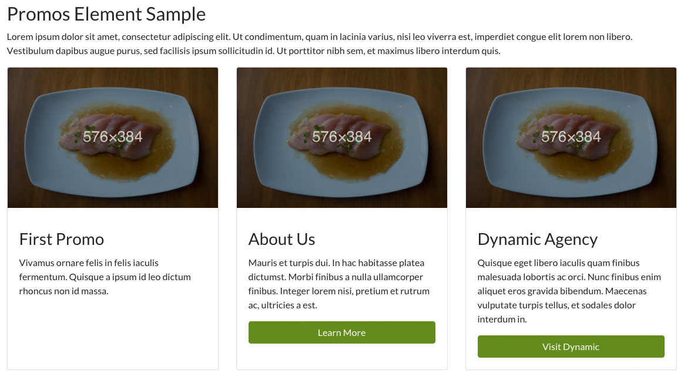
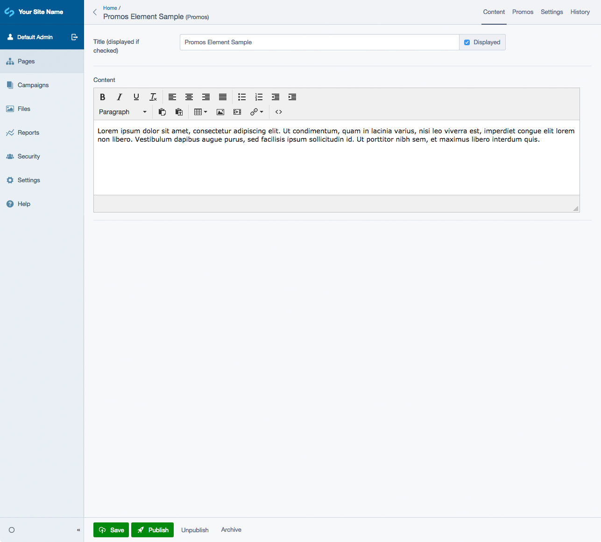
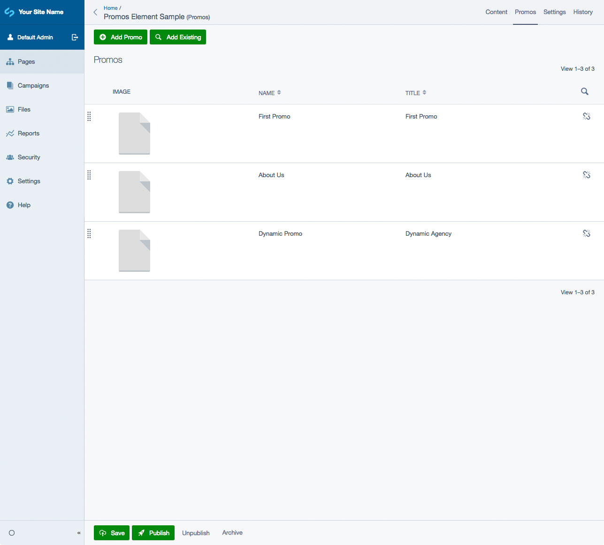
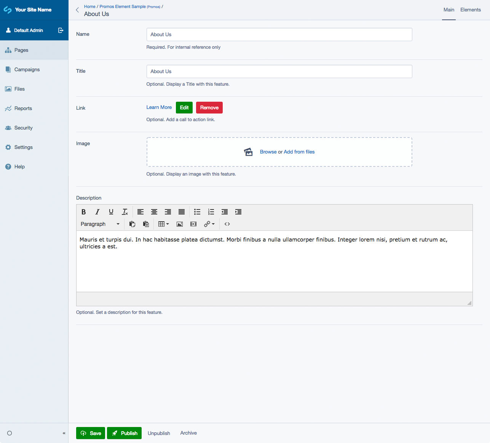

# Silverstripe Elemental Promos

A block to display a group of promos - a small card with an image, headline, short desciption, and link.

[](https://github.com/dynamic/silverstripe-elemental-promos/actions/workflows/ci.yml)
[](https://codecov.io/gh/dynamic/silverstripe-elemental-promos)

[](https://packagist.org/packages/dynamic/silverstripe-elemental-promos)
[](https://packagist.org/packages/dynamic/silverstripe-elemental-promos)
[](https://packagist.org/packages/dynamic/silverstripe-elemental-promos)
[](https://packagist.org/packages/dynamic/silverstripe-elemental-promos)

## Requirements

* dnadesign/silverstripe-elemental: ^4.8
* dynamic/silverstripe-elemental-baseobject: ^3.0

## Installation

`composer require dynamic/silverstripe-elemental-promos`

## License

See [License](license.md)

## Upgrading from version 2

Elemental Promos drops `sheadawson/silverstripe-linkable` usage in favor of `gorriecoe/silverstripe-linkfield`. To avoid data loss, install the `dynamic/silverstripe-link-migrator` module as follows:

```markdown
composer require dynamic/silverstripe-link-migrator
```

Then, run the task "Linkable to SilverStripe Link Migration" via `/dev/tasks`, or cli via:
```markdown
vendor/bin/sake dev/tasks/LinkableMigrationTask
```

This will populate all of the new Link fields with data from the old class.

## Usage

A content block to display a group of promos - a small card with an image, headline, short desciption, and link. Typically this will display 3 to 4 promos per row depending on layout restrictions.

### Template Notes

The default templates are based off [Bootstrap 4](https://getbootstrap.com/) classes/styling

## Screen Shots

#### Front End sample of a Promos Element


#### Alternate Front End sample of a Promos Element (uses Card Deck include)


#### CMS - Promos Main Tab


#### CMS - Promos Block - Promos List


#### CMS - Promos Block - Promo Edit



## Getting more elements

See [Elemental modules by Dynamic](https://github.com/orgs/dynamic/repositories?q=elemental&type=all&language=&sort=)

## Configuration

See [SilverStripe Elemental Configuration](https://github.com/dnadesign/silverstripe-elemental#configuration)

## Translations

The translations for this project are managed via [Transifex](https://www.transifex.com/dynamicagency/silverstripe-elemental-promos/)
and are updated automatically during the release process. To contribute, please head to the link above and get
translating!

## Maintainers

 *  [Dynamic](http://www.dynamicagency.com) (<dev@dynamicagency.com>)

## Bugtracker
Bugs are tracked in the issues section of this repository. Before submitting an issue please read over
existing issues to ensure yours is unique.

If the issue does look like a new bug:

 - Create a new issue
 - Describe the steps required to reproduce your issue, and the expected outcome. Unit tests, screenshots
 and screencasts can help here.
 - Describe your environment as detailed as possible: SilverStripe version, Browser, PHP version,
 Operating System, any installed SilverStripe modules.

Please report security issues to the module maintainers directly. Please don't file security issues in the bugtracker.

## Development and contribution
If you would like to make contributions to the module please ensure you raise a pull request and discuss with the module maintainers.
